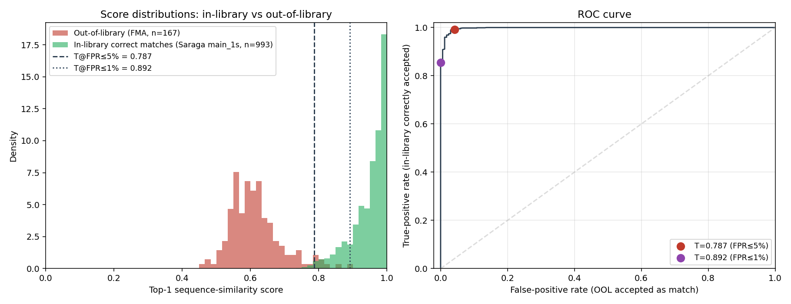

# Threshold Calibration Results — Recipe v3 seed 42

**Pre-registered:** see [`PROTOCOL.md`](PROTOCOL.md) (locked before measurement).
**Generated:** 2026-05-15.

## Score distributions

| Distribution | n | mean | min | p5 / p95 | max |
|---|---|---|---|---|---|
| In-library correct matches (Saraga main_1s) | 993 | 0.9479 | 0.6891 | p5=0.8401 | 0.9997 |
| Out-of-library (FMA-medium random) | 167 | 0.6155 | 0.4570 | p95=0.7660 | 0.8918 |

## Chosen thresholds (pre-registered rule)

| Operating point | T | FPR (OOL accepted) | TPR (in-library accepted) | TPR 95% CI |
|---|---|---|---|---|
| Default (FPR ≤ 0.05) | **0.7867** | 0.0419 (95% CI: 0.020, 0.084) | 0.9909 | (0.983, 0.995) |
| High-confidence (FPR ≤ 0.01) | **0.8918** | 0.0000 (95% CI: 0.000, 0.022) | 0.8540 | (0.831, 0.875) |

## Feasibility check

- Pre-registered criterion: TPR ≥ 0.95 at FPR ≤ 0.05 → **PASS** (actual TPR = 0.9909)

## Use in the demo

- If top-1 score ≥ **0.7867**: display `"Match found"` with the predicted ref
- If top-1 score ≥ **0.8918**: also show a `"high confidence"` badge
- Else: display `"No match in library (query may be out-of-scope)"`

## Visual

